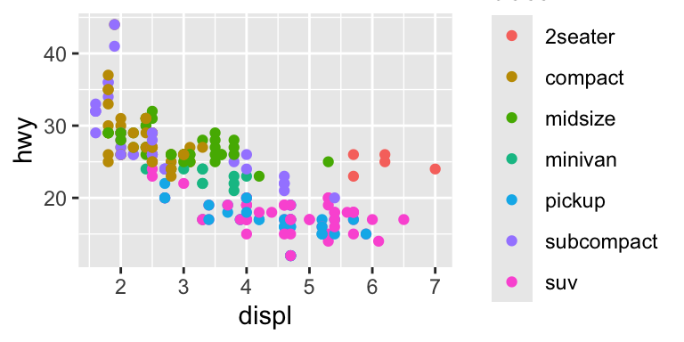
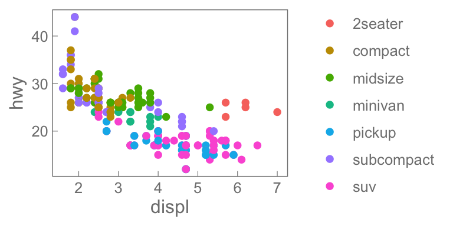

# MKHthemes

## Statement of need

The default appearance of `ggplot2` graphics is unattractive. Tick marks
point outward (away from the data). Grid lines are provided (are we in
jail?). Borders are black (taking focus away from the data). The
background color is gray, not white.

This package (`MKHthemes`) provides a nice-looking theme for `ggplot2`
graphs, solving the problems identified above.

## Installation

You can install `MKHthemes` from GitHub with:

``` r

# install devtools if not already installed
# install.packages("devtools")
devtools::install_github("MatthewHeun/MKHthemes")
# To build vignettes locally, use
devtools::install_github("MatthewHeun/MKHthemes", build_vignettes = TRUE)
```

## Examples

Out of the box, \[ggplot2\] graphs look like this:

``` r

library(ggplot2)

ggplot2::ggplot(mpg, ggplot2::aes(x = displ, 
                                  y = hwy, 
                                  colour = class)) +
  geom_point()
```



To improve the graph, do the following:

``` r

ggplot2::ggplot(mpg, ggplot2::aes(x = displ, 
                                  y = hwy, 
                                  colour = class)) +
  geom_point() + 
  MKHthemes::xy_theme()
```



## More Information

Find more information, including vignettes and function documentation,
at <https://MatthewHeun.github.io/MKHthemes/>.
